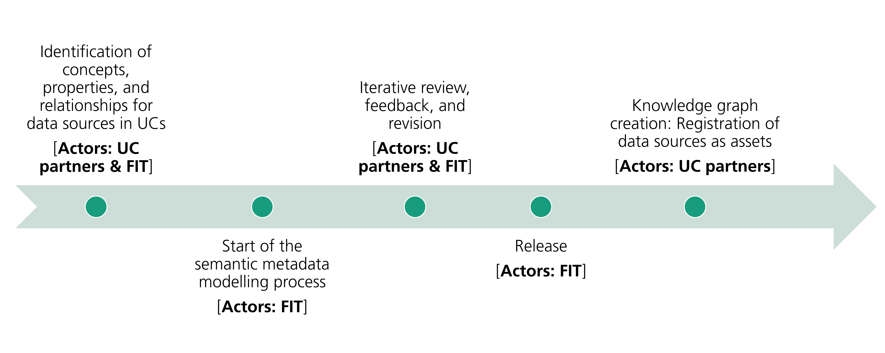
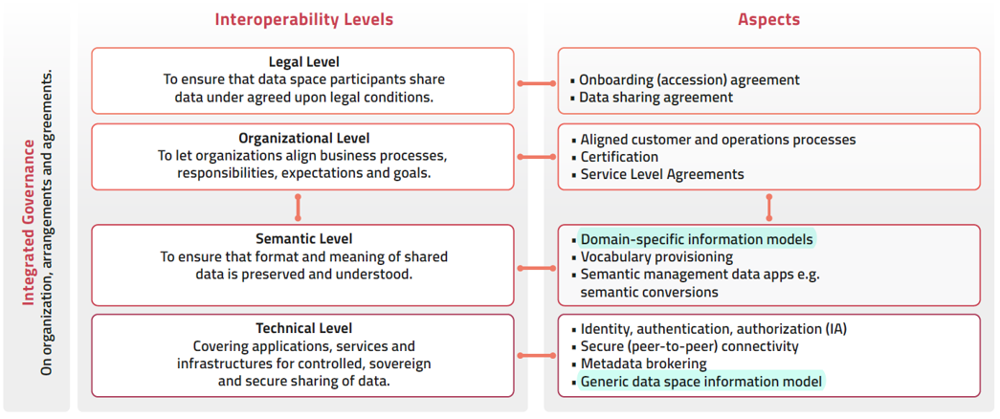

# DRK Information Model
**Datenraum Kultur Information Model (DRK IM)**: The DRK IM is a Semantic Information Model that aims to define formal specifications of concepts, relationships, and constraints (application profiles) within the data space for culture. This formalization provides a structured framework for understanding and organizing information within the DRK project. In addition, this forms a basis for representing information in DRK in the form of a Knowledge Graph (DRK KG) with more advanced querying, inference, and reasoning capabilities.

# Naming Conventions
- **Directories and files**: All small letters, separated by hyphens (-). Example: `drk-ontology.ttl`
- **Prefixes**: In DRK Ontology, we use http://prefix.cc/ to abbreviate URIs
- **Versioning**: DRK IM release snapshots will follow the [Semantic Versioning Specification 2.0.0](https://semver.org/spec/v2.0.0.html) (SemVer - Major.Minor.Patch)

# How-To (DRK IM Development Process)

## Goals
- This code repository aims to enable collaboration among domain experts (Use Case (UC) partners) and Semantic Web experts (FIT DRK IM Group) to develop the DRK IM. 
- Here, we aim to create extensible semantic schemas (metadata templates) and application profiles (constraints: mandatory, recommended, and optional) for data sources from the DRK use cases.

## Prerequisite
- Documentation of your data sources (APIs, Datasets) to be connected to the DRK infrastructure in this document: [Template Datennehmer-geber und Nutzungsvereinbarungen v1.1.xslx](https://acatechev.sharepoint.de/:x:/r/sites/DRKulturUseCasesTest/_layouts/15/doc2.aspx?sourcedoc=%7B675D2413-1C4F-4DF3-B64B-D1823BD7DDB8%7D&file=Template%20Datennehmer-geber%20und%20Nutzungsvereinbarungen%20v1.1.xlsx&action=default&mobileredirect=true). 
- To get started with semantic modelling, we generally need the following information which can be entered there: Use Case (UC1, UC2, UC3, UC4); Stakeholder: Data Provider; Data Source Type (API / Dataset); Data Source Name; Data Source Short Description; URLs to Interfaces (GUI, API, Download Link); URL to API specification OR API/Dataset Documentation; Data Format (JSON, JSON-LD, CSV, etc.); Data Model: Any Additional Information such as the Data Fields it Contains and How it is Structured, any Referred Ontologies, Standard Data Models, etc.; Examples; License / Data Usage Policy, etc.

## Steps

1. **Identification of concepts, properties, and relationships**
- **Actors**: UC partners (domain experts), with support from FIT DRK IM Group (Semantic Web experts), if required.
- For one/more data sources, (preferably) **a UC partner creates a new GitHub issue** and specifies new concepts, properties and/or application profiles (constraints) to be added to the DRK IM.
- Preferable format: A graph (or JSON) that specifies the concepts, properties, and their interrelationships. A link to Miro, Mural, draw.io, or lucidchart board is also welcome. Where possible, the UC partner suggests existing ontologies or vocabularies where these concepts are defined. Even semantic descriptions in TTL/TRIG/JSON-LD format can be entered.

2. **Semantic modelling**
- **Actors**: FIT DRK IM Group.
- The **DRK IM group reviews and creates semantic descriptions and constraints** (SHACL shapes) preferably based on the ontologies identified in the DRK IM layers diagram (see below).
- If certain concepts/properties do not exist in any of the existing ontologies, they are defined in the DRK ontology.

3. **Iterative review, feedback, and revision**
- **Actors**: UC partners and FIT DRK IM Group.
- The UC partners review the semantic descriptions and constraints, and they are **updated in an iterative manner** together with the DRK IM group. 
- Once final, they are **merged as a pull request** with the DRK IM repository’s `main` branch.

4. **Release**
- **Actors**: FIT DRK IM Group.
- The DRK IM release snapshots will follow the SemVer versioning specification.

5. **Knowledge graph creation / registration of data sources as assets**
- **Actors**: UC partners, with support from FIT DRK IM Group, if required.
- For creating semantic metadata for the data sources which is required for their registration as assets, the schemas and application profiles from the DRK IM can be used.
- This registration of data sources happens through EDC’s user interface or API.
- This forms the DRK Knowledge Graph (DRK KG).

# More Information

### DRK IM in the Context of the European Interoperability Framework (EIF)

DRK IM focuses on the interoperability aspects within the Technical and Semantic Levels of the EIF, particularly the use of generic and domain-specific information models, together with tooling support to enable interoperability in the data space for culture.

(Image sources: [iSHARE Cookbook for Data Spaces](https://ishare.eu/wp-content/uploads/2023/09/iShare-Data-Spaces-Kookboek_UK-v1.pdf), [EIF]( https://joinup.ec.europa.eu/collection/nifo-national-interoperability-framework-observatory/european-interoperability-framework-detail))

### DRK IM Layers (Work in progress)

To facilitate both the modular representation and FAIRness (Findability, Accessibility, Interoperability, and Reusability) of information, the DRK IM is structured into layers, as illustrated in the following figure. These layers are realized using the existing ontologies and vocabularies.

(Graphic: Rohit Deshmukh, Daham Mohammed Mustafa/Fraunhofer FIT)